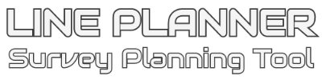

## Contents

1. UX Design
2. Features
3. Technologies Used
4. Testing
5. Deployment
6. User Guide
    - How to Navigate the Map Space
    - How to View Map Coordinates
    - How to Draw a Polygon Boundary on the Map Space
    - How to Edit the Polygon Boundary on the Map Space
    - How to View the Polygon Boundary Coordinates
    - How to Export and Save the Polygon Boundary Coordinates
    - How to Import a Polygon Boundary Coordinates
    - How to Draw Lines on the Map Space
    - How to Edit a Line on the Map Space
    - How to View Line Coordinates
    - How to Export and Save the Line Coordinates
    - How to Import Line Coordinates
    - How to Obtain Statistics
7. Credits
8. Contributing
9. Support
10. License

## UX Design

The Line Planner site was designed around User Experience Design Principles. Target users were identified and business and user
goals were defined. A minimum viable product was determined that could achieve these goals. Future development potential was also
mapped out. The scope was set to ensure the project remained concise and fit the strategy, and the structure reflected this
scope whilst identifying the various APIs and technologies that would be used in the initial site version, as well potential future
expansion. The skeleton of the site was defined using wireframe models, which assisted in making key design decisions and targets prior to
commencing site construction, including site responsiveness considerations. Surface design was considered to identify suitable look and 
feel for this site, which is aimed at a mainly professional audience.

A review meeting was held following the initial UXD process which refined some areas including suitable API technologies and the scope of the project.

### Strategy

The following stakeholders and their goals were identified:

#### The Business

- Create a simple, intuitive line planning and survey duration estimate platform which uses familiar front-end elements e.g. Google Maps.
- Allow users to import specific file types, create new files and add and alter elements/features within existing and new files.
- Provide a simple, semi-automated summary of calculated statistics for the line plan, including distance, number of lines, and expected duration.
  - Make it very clear what data has been included and omitted to calculate this.
- Ensure the platform could be expanded for more complex use in the future.

#### Target Users/Customers

This product is intended as an internal business or B2B tool with the aim to provide commercial/tendering and bidding departments
within survey companies such as Hydrographic or Aerial with a tool that can produce technically challenging outputs without the
requirement to be highly skilled with techincal software such as CAD or GIS packages. The tool is designed for first stage survey
tender submission where indicative costs (dictated by survey duration) estimates are required by the client. At this early potential
survey project stage the estimatation process must be quick, easy and ituitive but retain a high degree of accuracy to ensure confidence
in the bid. Any outputs from this tool should be able to be handled by techincal departments in more advanced software should the project
progress.

#### User goals

As a tender coordinator within a survey company there is a requirement to quickly produce a quote for works on potential bids. A key
component of this is an estimate of survey duration. Survey duration is affected by a number of factors which include the number of lines
and the total line distance to acquire. In order to calculate this an indicative survey line plan is required. However traditionally this
must be completed by specialist technicians on bespoke software. Relying on this resource present issues with staff availability vs deadlines
and cost of the bespoke software license. In many instances a simple preliminary plan will suffice and if the coordinator is able to perform
this task independently with confidence in their potentially limited technical skillset the bid can be more robust and submitted in a timely
manner.

As a sole trader operating a small Remotely Piloted Vehicle survey service the overheads of purchasing bespoke CAD/GIS software and the cost
of spending time training and developing skills to use them are often prohibitive. A simple, cheap solution with a quick rate of learning and
familiar feel is ideal to create flightpaths and waypoints to load into UAV software.

As a skilled technically competent member of a survey company there is a requirement for the commercial team to correctly bid a project to
prevent unexpected increased to project durations and costs once the bid is won and the technical team create the final operational plan. If the
technical team can be provided a draft line plan which they have confidence in most of its particulars in an easy to handle file format then it
can be more closely adhered to and modified for use in the field.

#### Opportunity

An opportunity importance vs feasibility assessment was carried out to inform on decisionns regarding the Minimum Viable Product:
[Opportunity Assessment Analysis](assets/docs/opportunityAssessment.pdf)

#### Minimum Viable Product

- A web hosted platform which is interactive in a single, unsavable session to the user.
- Present a base map which the user can add elements and features on top of.
  - Allow click drawing of polylines and polygons on the map.
  - Allow simple text files with coordinates in a specified format to be imported into a GeoJSON and displayed on the map.
  - Allows elements to be created based on other elements.
  - Allows elements to be edited based on other elements.
- Coordinates are stored in JSON format as a GeoJSON.
  - Coordinates are also projected from Lat/Long to Easting and Northing (UTM Zones).
  - Coordinates are displayed in realtime to the user in both Geographic and Projected Formats
  - Coordinates can be removed as well as added.
  - Coordinates can be exported in a simple text format in both Geographic and Projected Formats.
  - The user clearly understands the limited input/output coordinate systems and expected formats.
- A summary of key statistics is calculated based on the elements loaded/drawn onto the map via the temporary GeoJSONs.

### Scope

The scope of the initial project version is to create a non-persistent single page interface which provides
the user with the tools to upload or create a basic polygon and draw and generate polyines with two or more
vertices on top of a digital map or satellite imagery workspace. The site will calculate some base statistics
on the polygons and polylines and these features are exportable in a basic text format.

- Single Page Design
  - No Navbar
  - A Logo which hovers over the Top Left of all content on the page
  - The entire page is dedicated to a Map API.
    - With the exception of a minimal footer.
  - Collapsible containers which draw over the Map API to allow user input such as loading and entering data, exporting data and viewing outputs.
  - Some core map manipulation tools presented as hovering buttons over the map.

#### User Stories

| User                                                                                     | Story                                                                                                                                                                                                                                                                                                                                                                                                                                                                                                                                                                                                                                                                                                                                                                                                                                                                                          |
| ---------------------------------------------------------------------------------------- | ---------------------------------------------------------------------------------------------------------------------------------------------------------------------------------------------------------------------------------------------------------------------------------------------------------------------------------------------------------------------------------------------------------------------------------------------------------------------------------------------------------------------------------------------------------------------------------------------------------------------------------------------------------------------------------------------------------------------------------------------------------------------------------------------------------------------------------------------------------------------------------------------- |
| Tender coordinator or similar within a hydrographic or aerial survey acquisition company | As a survey tender coordinator, I want to ensure my bid is accurate regarding survey time estimates. I have a tight deadline and cannot wait for support from the GIS/CAD team. I need a reliable indicative line plan that I can easily create myself. The client provided me with a list of coordinates which make up a boundary, and these are in WGS84 latitude and longitude or UTM eastings and northings along with the given zone. The application allowed me to input these coordinates and generate a basic plan despite having little to no experience with CAD or GIS. It also provided me with the distance and duration estimates I need to apply costs to my bid. I was able to create a basic, human readable export which I can provide to the technical team if we win the work.                                                                                             |
| Sole trading independent remotely piloted aerial vehicle operator.                       | My expertise is in the safe operation of aerial “drones” and the collection of photogrammetry data. I am not familiar with survey packages and terminology, or the complexities of different coordinate systems and datums. I have little to no GIS/CAD experience and don’t know anyone who does that can support me. My client requires me to run survey lines over an area to collect the required data and I need waypoints to input into my vehicles autopilot system. The client has provided me with the survey area as a list of positions in WGS84 latitude and longitude or UTM eastings and northings along with the given zone. I was able to visualise this area over Google Maps, which I am familiar with, identify from Google satellite imagery any potential obstacles, and produce a line plan which provides start and end coordinates that I can enter into my autopilot. |
| Competent surveyor/GIS/CAD technician                                                    | I’ve been assigned to a new project that my company has recently been awarded following a successful bid. My project manager has asked me to create a final line plan for the survey acquisition and provided me with the client boundary, along with a file containing the data from the as-bid indicative plan. I’ve quickly been able to load both of these into the propriety acquisition software, make an assessment on its suitability and make any adjustments as required. I’ve now moved onto different parts of the planning and preparation process.                                                                                                                                                                                                                                                                                                                               |

### Structure

As a product designed to be utilised by non-technical operators to produce techincal
outputs quickly it is important to make the experience simple and rewarding for the user.
The site consists of one page and makes use of collapsing sections which cover over parts
of the main content of the page, which is a full-page Map API area. The
collapsing sections provide more in-depth interaction such as input forms and
file upload/download functions and can be left expanded by the user if desired. Core
functionality is provided more permanently over the main map area in the form of
simple buttons. 

A combination of [Mapbox](https://www.mapbox.com/) Map APIs, and open source libraies of geodesy tools provided by
[Movable Type Ltd](https://www.movable-type.co.uk/), [Moveable Type GitHub](https://github.com/chrisveness/geodesy)
and [Turf.js](https://turfjs.org/), JQuery and vanilla Javascript have been used to create the sites 
functionality.

User created data is not persistently stored allowing the workspace to be quickly reset if the page
is refreshed.

Future expansion considerations have also been considered. If the saving of data and the use
of multiple projects is to be rolled out on the site then including the use of a login page,
and a projects page before reaching the main map workspace would be prudent to ensure client
information data security and appropriate organisation. Suitable permanent storage solutions
would need to be applied, such as cloud/server/locally based storage.

The site is designed to be fully responsive and leans on some elements of Bootstrap for
this, however it is recommended that a desktop environment is used as the user has a better
array of inputs including a keyboard, mouse and greater screen real-estate.  
The site is more challenging to use on mobile and tablet devices but is fully designed to be
compatible with these devices.

As the site will initially not have more than one page, a navigation bar will not be required.

### Skeleton

The site will be responsive across all device sizes and utilise Bootstrap 4 breakpoints to achieve this. The site will 
be easiest to use on lg and above device sizes due to screen real estate and user input options. As Bootstrap is optimised for 
smaller mobile devices I will create a custom “XXL” breakpoint to accommodate extra large and high definition devices, where XL 
breakpoint would begin to become oversized and “blown-up”.

| Bootstrap Breakpoint ID | Minimum Pixel Width | Maximum Pixel Width |
| ----------------------- | ------------------- | ------------------- |
| XS - SM                 | 1px                 | 767px               |
| MD - LG                 | 768px               | 1199px              |
| XL                      | 1200px              | 2559px              |
| XXL (Custom breakpoint) | 2560px              | Infinite            |

Common device sizes are:

- Mobile Phones (xs-sm Bootstrap sizing)
- Recreational Tablets (md Bootstrap sizing)
- Professional Tablets (lg Bootstrap sizing)
- Laptops and Desktops (XL Bootstrap sizing)
- TVs, projectors and high definition monitors (XXL Custom sizing)

[Wireframes](assets/docs/wireframes.pdf) were constructed in Basamiq Wireframe 4 in order to provide a design brief for
the project, maximise coding productivity and minimise mission creep. The final product is compared to the wireframes within this document.

### Surface

The site is dominated by a map API which can be presented in a variety of styles including the default street, satellite, a hybrid of these, or 
light and dark modes. This presented a visual challenge in selecting appropriate interface controls and visuals which would be clear and legible
across all the backdrops. The choice of mildy transparent containers which sit above the main map retain the emphasis on the map element to the user
and the use of vibrant colours not typically found on the map element help to segrate these from the map visually. Keeping colours consistent between
linked feature types, such as blue for the Boundary interface and the actual boundary polygon on the map assist the user in making the link between
these two elements visually. 

## Features

### Existing Features
Users have the ability to: 

- See a map space of the entire world.
- Switch this map space between several visual representation styles.
- Have an appreciation for the map view scale thanks to a scale bar.
- Be aware of map orientation thanks to an interactive North arrow.
- Opt in to view their location with geolocation services.
- Obtain instant geographic position information of their mouse cursor or last touch point, dependant on device. 
- Obtain instant projected position information including UTM Zone identification based on their mouse cursor or last touch point, dependant on device.
- Draw a single polygon and view its geographic and projected coordinates in a table. 
    - Overwrite the polygon quickly by drawing or importing another. 
- Export the polygon coordinates table as a CSV as either geographic or projected coordinates. 
- Import a csv file containing polygon information following the rules outlined in the details section below the import interface. 
    - Allows previously exported geographic polygons to be re-imported. 
- Obtain statistical information on the drawn or imported boundary including the area and perimeter size of the boundary. 
- Draw multiple lines containing two or more vertices and view their geographical and projected coordinates in a table. 
- Export the line vertices coordinates table as a CSV as either geographic or projected coordinates. 
- Import a csv file containing line information following the rules outlined in the details section below the import interface. 
    - Allows previously exported geographic lines to be re-imported. 
- Obtain statistical information on the drawn or imported lines including the length and number of lines. 
- Obtain estimated travel durations on line, between lines and a total combined duration based on user input speeds and time between one line and another. 

### Future Features
Future features yet to be developed include:

- Export statistics to a final report. 
- Export an image of the map space with features loaded. 
- Improved user guidance through automatic and user instigated pop-ups/modals and tooltips. 
- Ability to import projected coordinate csv files for both polygons and lines. 
- Ability to import other file formats such as GeoJSON or DXF. 
- Function to crop lines to the boundary. 
- Function to extend lines to the boundary. 
- Function to create new line features at a user input offset from an existing feature. 
- On screen distance measurement via click or touch dependant on device. 
- Ability to assign names to features and appropriately display these. 
- Ability to save sessions locally or on the server to be loaded again later following closing of the site.
- Ability to handle, load and create multiple files (plans and boundaries).
- Ability to handle, transform a project into a variety of coordinate systems and geodetics.

## Technologies Used

### Bootstrap 4.5.2

[Bootstrap Homepage](https://getbootstrap.com/)

Bootstrap was utilised to provide responsive front-end design via a component library. It is able to provide some
JavaScript functionality including collapse and accordion section div control.

#### License

Bootstrap is released under the [MIT License](https://tldrlegal.com/license/mit-license)

A copy of this license is provided in Bootstraps GitHub Project: https://github.com/twbs/bootstrap/blob/v4.5.0/LICENSE

Bootstrap Copyright is as follows: Copyright (c) 2011-2020 Twitter, Inc. Copyright (c) 2011-2020 The Bootstrap Authors

### jQuery

[jQuery Homepage](https://jquery.com/)

jQuery is a JavaScript library designed to make html traversal and manipulation
much simpler than raw JavaScript, by presenting the author with a wealth of
simple code and commands which call on much more complex functions.

jQuery was utilised to improve the targeting of elements and provide some support
for animation and user interaction where possible.

#### License

jQuery is provided under the [MIT License](https://tldrlegal.com/license/mit-license)

### Mapbox

[Mapbox Homepage](https://www.mapbox.com/)

Mapbox forms the foundation platform for the map interface, providing background map data such as the street and satellite
information, GeoJSON interaction and geographical coordinates across the page.

#### License

Mapbox operates a pay-as-you-go approach to useage, requiring an account and an active access token in use on the site. It
provides a generous number of free maploads per month before costs are incurred.

Mapbox is an open source project. Its license can be found here [Mapbox.js Open Source License](https://github.com/mapbox/mapbox.js/blob/publisher-production/LICENSE.md)

### Mapbox draw

Mapbox draw is an open source plugin designed to interact with Mapbox javascript platform to allow developers to create geospatial
drawing functionality such as polygons and lines which have geolocated attributes, stored in GeoJSON format. It was used to
produce the polygon and line drawing functionality and its features collection is targeted to obtain the numerical information
presented to the user such as coordinates.

#### License

Mapbox draw operates an open source license [Mapbox Draw License](https://github.com/mapbox/mapbox-gl-draw/blob/main/LICENSE)

### Turf

[Turf.js Homepage](https://turfjs.org/)

Turf.js is an open source module designed to interact with geospatial data in a variety of formats including arrays and GeoJSONs
to provide analysis and outputs to a user. It was utilised within this site to calculate areas and line lengths, and convert
arrays to GeoJSON LineString features.

#### License

Turf.js is provided under the MIT license [Turf.js License](https://github.com/Turfjs/turf/blob/master/LICENSE)

### Moveable Type Scripts Geodesy Library

Moveable Type Scripts Geodesy Library was utilised in this project to convert WGS84 latitude and longitude coordinates obtained
from Mapbox and Mapbox Draw into projected UTM (Universal Transverse Mercator) Easting and Northing Coordinates.
[Moveable Type Scripts Geodesy Library](https://www.movable-type.co.uk/scripts/geodesy-library.html)

#### License

Moveable Type Scripts Geodesy Library is provided under the MIT license. [Chrisveness Geodesy License](https://github.com/chrisveness/geodesy/blob/master/LICENSE)

### LogoMakr

Produced the brand logo using a combination of Google Fonts and icons.

[LogoMakr Homepage](https://logomakr.com)

#### License

Logos created via LogoMakr are approved for both personal and commercial use.

[LogoMakr License](https://logomakr.com/getstarted/terms-conditions/)

### Google Fonts

Google Fonts offers open source font styling options for personal and commercial use. 2 fonts were used within style.css. One of these fonts was also used within Logomakr to create the site logo.

#### License

The use of this product was inline with Google API's terms of service [Google Fonts Terms](https://developers.google.com/terms)

## Testing

### Browser Compatibility

Google Chrome is the recommended platform for this site. 

Site browser compatability was tested as described in the below table:

|Browser| Version| Comments| Fixes Applied|
|-------|--------|---------|--------------|
Google Chrome| 86.0.4240.183 64-bit| Issue with overflow sizing of tables at certain media sizes.| Altered sizing from % to Vh. |
Mozilla Firefox| 79.0 64-bit| Toolbar display: inline-block results in incorrect vertical alignment.| Assigned css property vertical-align: top to #toolbar .mapboxgl-ctrl-group.|
Microsoft Edge|	86.0.622.69 64-bit|	Fully Functional| |
Microsoft Internet Explorer| 11.630.19041.0| None functional. Mapbox API will not load, interface elements will not load.| None. Legacy platform not supported by mapbox gl or this site.| 	
Samsung Internet| 12.1.4.3| minor left interface header width intermittent issue whereby it sometimes becomes larger than intended.| No fixed at this time.|
Opera|	72.0.3815.186 64 bit| Fully Functional| |	
Apple Safari|	N/A	Could not be tested.|Microsoft Windows no longer supported.| |

### Responsiveness

The site was launched in [Am I Responsive.is](http://ami.responsivedesign.is/) to verify that the layout was responsive across various device sizes. 
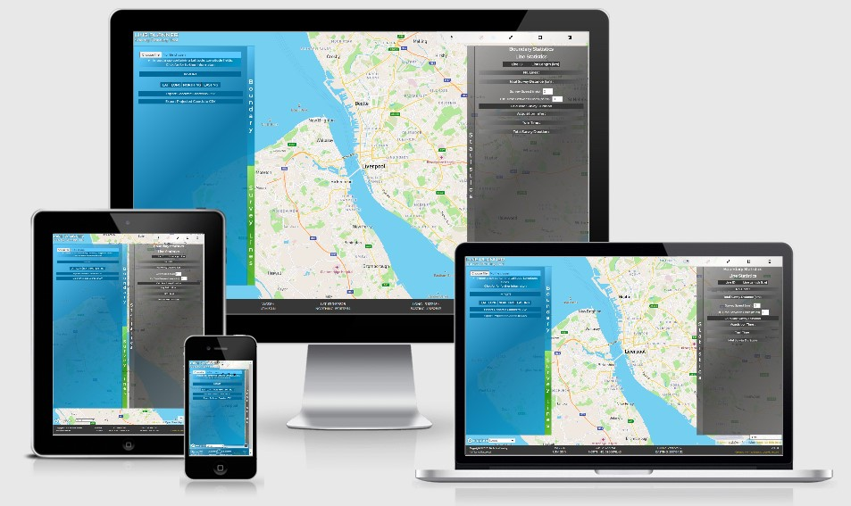

The site has also been tested for responsiveness using Google Chromes' built in devices found in its inspect utilities. 
Examples of Google Chromes' results can be found in [wireframes.pdf](assets/docs/wireframes.pdf).

### Geodetics

To confirm the UTM projection component was correctly projecting the WGS84 coordinates into UTM Eastings and Northings a sample of coordinates were projected through
the site and compared to a third party tool for projections. The third party tool utilised in this instance was [QPS Qinsy](https://qps.nl/) v9.2.2 hydrographic acquistion software
which utilises a comprehensive suite of geodetic transformations and projects based upon [EPSG](https://epsg.org/home.html) (Eurpoean Petroleum Survey Group) standards.  

|WGS84 LAT| WGS84 LONG|UTM Zone| Website Northing| Website Easting| QPS Qinsy Northing| QPS Qinsy Easting|
|---------|-----------|--------|--------------|-------------|-------------------|------------------|
|53.4518973|-3.0511340|30N|5922543.51|496604.32|5922543.51|496604.32|
|51.1259304|10.0731290|32N|5664376.51|575096.08|5664376.51|575096.08|
|-23.4932992|133.6083969|53S|7401182.43|357900.29|7401182.43|357900.29|

### User Stories

During the scope phase of UX design for this project three user stories were identified. These have been assessed against the current product to ascertain the suitability of the product to the end user based on the initial design objectives. 

| User                                                                                     | Story Assessment                                                                                                                                                                                                                                                                                                                                                                                                                                                                                                                                                                                                                                                                                                                                                                                                                                                                                          |
| ---------------------------------------------------------------------------------------- | ---------------------------------------------------------------------------------------------------------------------------------------------------------------------------------------------------------------------------------------------------------------------------------------------------------------------------------------------------------------------------------------------------------------------------------------------------------------------------------------------------------------------------------------------------------------------------------------------------------------------------------------------------------------------------------------------------------------------------------------------------------------------------------------------------------------------------------------------------------------------------------------------- |
| Tender coordinator or similar within a hydrographic or aerial survey acquisition company | I can obtain survey time duration estimates quickly without a requirement for bespoke software or significant expertise. I can load thrid party supplied coordinates into the platform by following the guidance provided. I can only do this with WGS84 coordinates and not projected coordinates. I can export my work for further use and to save my progress.|
| Sole trading independent remotely piloted aerial vehicle operator.                       | The platform interaction is familiar to me having many similairities to publicly consumed apps such as Google Maps. I have a range of map styles to choose from to assess any potential safety concerns, such as proximity to airports or vegetation cover. I was able to create a waypoint listing from lines I drew, and put them into my drone mission planner. |
| Competent surveyor/GIS/CAD technician                                                    | I was able to use the csv exports from Line Planner and import them into my CAD/GIS package be defining the file format parameters. I was then able to continue to work on this plan to make it ready for a live survey project that is readable by our acquistion software QPS Qinsy. |

### W3C HTML Validator

| Message Type | Message | Action Taken |
| ----------------------- | ------------------- | ------------------- |
| Error| Element p not allowed as child of element summary in this context.| None, required for correct styling (margins). |
| Error| th start tag in table body.| None, risk of affecting scripts targeting these elements as children.|
| Warning| The type attribute is unnecessary for JavaScript resources.| None, only advisory. |

### W3C CSS Validator
No errors were detected in style.css or mapboxOveride.css.

## Deployment

The Site is stored and hosted on GitHub Pages.

It consists of 1 Master branch and no other branches.

The URL for the site is: https://kwsnick.github.io/Line-Planner/

The URL for the GitHub Project is: https://github.com/KWSNick/Line-Planner

The site contains a resticted access token to mapbox, which limits it use to specific URLs to prevent abuse by a third party. 

The access token is limited to 50,000 map loads per month, with a maximum persistent load session of 12hrs before a new load is counted. 

The site is designed to work on any modern browser, but was developed witihin Google Chrome version 86.0.4240.183 and it is recommended this platform 
be utilised in preference to others to ensure full compatibility and functionality. See browser compatibility section within testing for further details. 

### Current Version

- v1.0.0 - Intial Release

### Version History

- v1.0.0 - Initial Release
- v0.1.0 - Beta Release
- v0.0.1 - Alpha Release

## User Guide

The following guide will instruct a user through each key function of the site. 

### How to Navigate the Map Space
Use the scroll wheel or finger pinch on touch screen devices to zoom in or out. 

Go to your location by clicking the "Find my location" button in the toolbar and accepting any permissions as required. 

Pan across the map by left click and dragging the map, or touch hold and drag on touch screen devices. 

Rotate the map view by right click and holding and then moving the mouse, or double finger holding and rotating on touch
screen devices. Reset the map rotation by clicking the North arrow in the toolbar. 

To change the map style click or touch the dropdown box in the bottom left corner and select the desired style. 

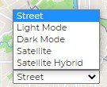

### How to View Map Coordinates
On devices with a mouse input device hover your mouse over any position on the map and read the latitude, Longitude, Easting, Northing
and UTM Zone information presented in the footer. This live infomation corresponds to your mouse position. 

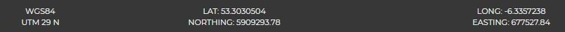

On touch screen devices the last touched position in the map will be displayed in the footer. 

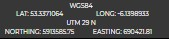

### How to Draw a Polygon Boundary on the Map Space

To draw a new boundary polygon select the Polygon tool from the toolbar.

When using a mouse left click on locations over the map space where you desire a polygon vertices (corner)
to be. For touch screen devices touch the desired locations. 

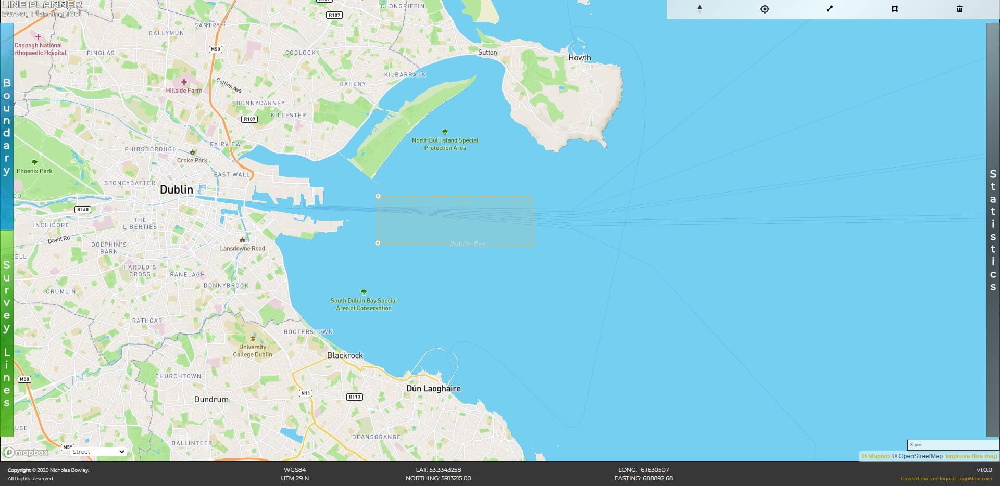

Left and then Right click on the last desired location in the polygon to close the polygon and complete the shape. For touch screen
devices double touch to close. 

Left click or touch outside the polygon to finalise the polygon. 

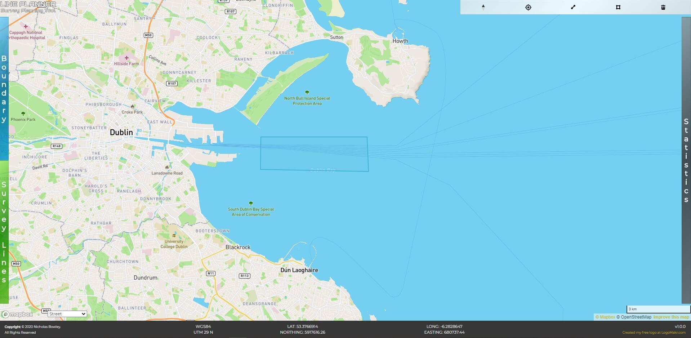

### How to Edit the Polygon Boundary on the Map Space

Double click or touch the finalised polygon to edit its vertices and shape. Here you can drag the vertices, delete them by selecting
the vertices to delete and pressing the delete key on your keyboard or Delete tool in the toolbar and add in new ones at nodes between the existing vertices. 

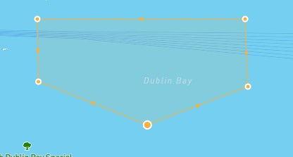

A single click or touch on the polygon will allow you to click/touch hold and drag the polygon across the map space 
or delete the entire shape via the delete key or delete tool in the toolbar. 

### How to View the Polygon Boundary Coordinates

To view the geodetic and projected coordinates of the vertices which comprise your polygon, click the "Boundary" header tab on the left
of the map space to expand the boundary interface. Here you will see a tables comprising of the vertices data. 

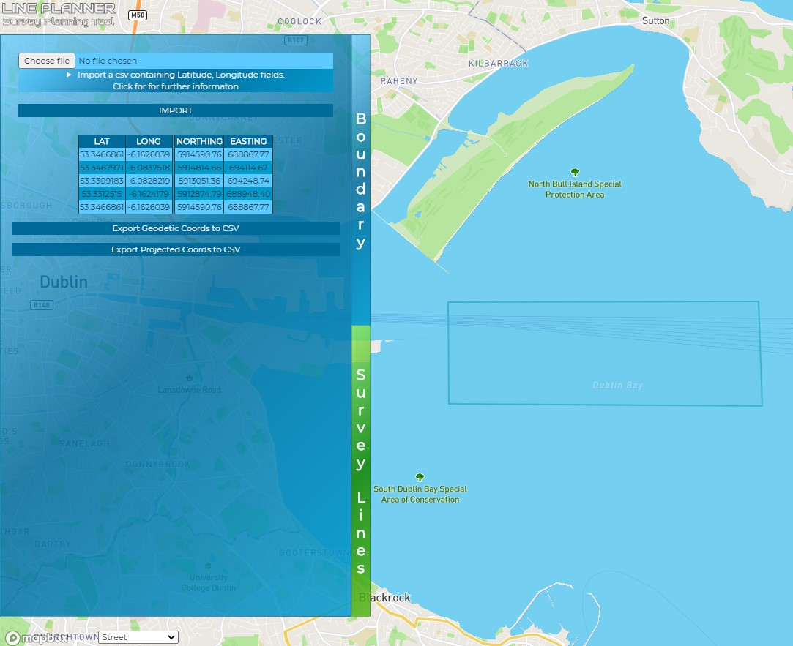

### How to Export and Save the Polygon Boundary Coordinates

To save an ASCII CSV file of the coordinates presented in the boundary table click "Export Geodetic Coords to CSV" and/or "Export Projected 
Coords to CSV". These buttons will save a file to your designated downloads folder. 

<mark>It is recommended to always export Geodetic Coords when a boundary is drawn as this format can be imported back into the site later if required.</mark>

### How to Import a Polygon Boundary Coordinates

Line Planner can import its own Geodetic Coords to CSV export file, allowing the user to save their work and re-load it later. 

If coordinates are provided prior to using Line Planner the user can follow the guidance presented in the details provided with the import function to create
a custom file which adheres to the export file format. 

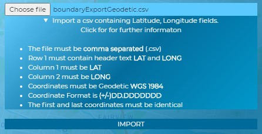

The import file must comply with these standards and be presented as below in a standard text editor such as notepad. 

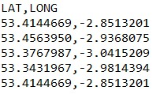

<mark>Note the first and last coordinates <strong>MUST</strong> be the same.</mark>

Once a polygon is drawn or imported any further imported or drawn polygon will <mark>delete the existing polygon and replace it.</mark> 
Only one polygon can exist in Line Planner at any one time. 

### How to Draw Lines on the Map Space

To draw a line select the LineString tool from the toolbar.

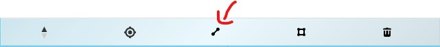

When using a mouse left click on locations over the map space where you desire a line vertices (corner)
to be. For touch screen devices touch the desired locations. 

Left and then Right click on the last desired location in the line to close the line and complete the shape. For touch screen
devices double touch to close. 

Left click or touch outside the line to finalise the line. 

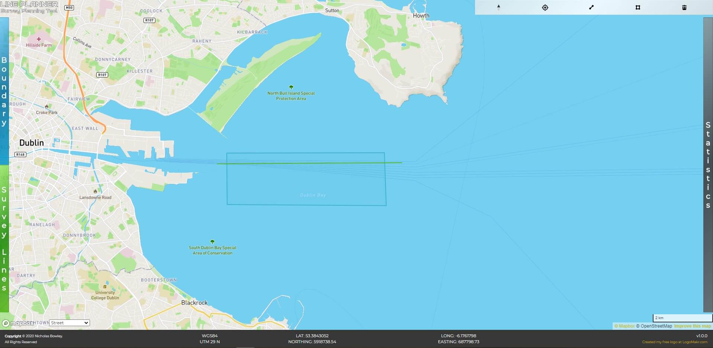

### How to Edit a Line on the Map Space

Double click or touch the finalised line to edit its vertices. Here you can drag the vertices, delete them by selecting
the vertices to delete and pressing the delete key on your keyboard or Delete tool in the toolbar and add in new ones at nodes between the existing vertices. 

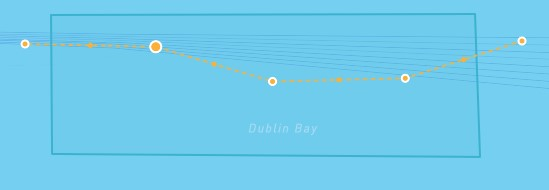

A single click or touch on the line will allow you to click/touch hold and drag the line across the map space 
or delete the entire shape via the delete key or delete tool in the toolbar. 

### How to View Line Coordinates

To view the geodetic and projected coordinates of the vertices which comprise your lines, click the "Survey Lines" header tab on the left
of the map space to expand the Survey Lines interface. Here you will see a tables comprising of the vertices data with a line ID number next to 
each vertices to indicate which line the vertices belongs to. 

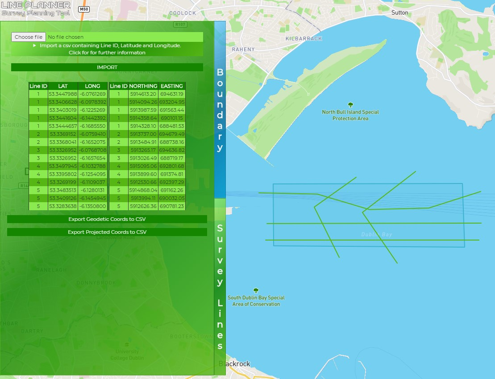

### How to Export and Save the Line Coordinates

To save an ASCII CSV file of the coordinates presented in the lines table click "Export Geodetic Coords to CSV" and/or "Export Projected 
Coords to CSV". These buttons will save a file to your designated downloads folder. 

<mark>It is recommended to always export Geodetic Coords regularly when drawing lines as this format can be imported back into the site later if required.</mark>

### How to Import Line Coordinates

Line Planner can import its own Geodetic Coords to CSV export file, allowing the user to save their work and re-load it later. 

If coordinates are provided prior to using Line Planner the user can follow the guidance presented in the details provided with the import function to create
a custom file which adheres to the export file format. 

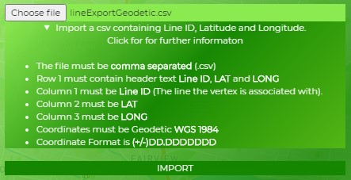

The import file must comply with these standards and be presented as below in a standard text editor such as notepad. 

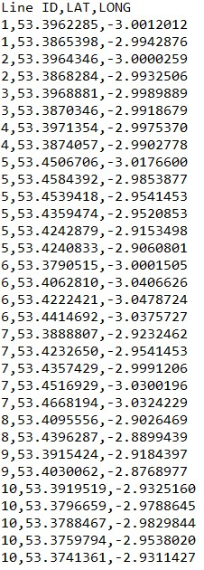

<mark>Note line ID is critical to line imports.</mark>

Importing a line file will <mark>delete all existing lines and replace them.</mark> 

### How to Obtain Statistics

Line Planner calculates key statistics about your boundary and lines. 

Expand the "Statistics" interface by clicking or touching the "Statistics header on the right. 

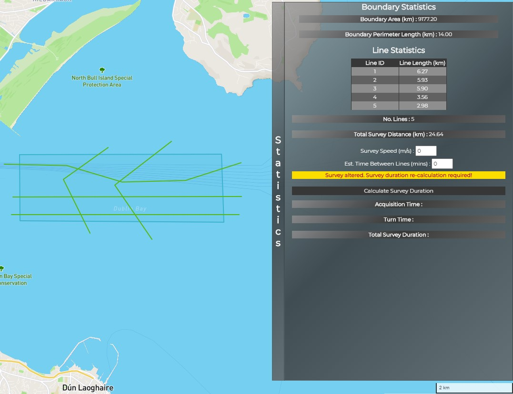

Some statistics are calculated automatically such as Boundary Area, Perimeter, Line Lengths, Number of Lines and Total Line Length.

The statistics interface allows the user to enter an estimated survey speed in metres per second, and an estimated time taken between
one line and the next (turn time). Entering a speed value is essential whilst turn time is optional. Once speed and turn time have been entered
the user can hit "Calculate Survey Duration" to obtain Acquistion, Turn and Total Survey Durations in hours, minutes and seconds. 

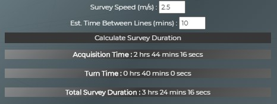

If the user then alters the line plan the statistics window will warn the user that the durations may be out of date, and the calculation should be 
re-performed. 

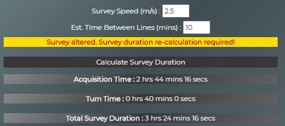

## Credits

### Content

Site content is original and developed by the author to offer services/functionality free-of-charge. No liability is assumed for any user experiences or results obtained from this website 
and users utilise this site, its functionality and its outputs at their own risk. 

The content, functionality and output was correct to the best of the authors knowledge at the time of issue (see testing for further details). 

### Media

Copyright 2020 Nicholas Bowley

The logo was created by the author in logomakr online tool and is accredited as per the instruction of the tool's developer. It is subject to copyright restrictions and limitations.

### Acknowledgements

Thanks must be attributed to Andreas Eriksson who posted their solution to converting a HTML table into an array in Stack Overflow 
on March 6th 2012 forming the basis for the code which performs a similar function in UTMproject.js.

Thanks is also given to cloakedninjas response within a Stack Overflow query June 2013 regarding creating a simulated key press trigger event 
which is utilised to trigger further listeners in this site.

[Codexworld](https://www.codexworld.com/export-html-table-data-to-csv-using-javascript/) must also be mentioned for providing guidance on
writing javascript to export files to users. 

A big thank you to Moveable Type Ltd for creating the API which performs the UTM projection functions, Turf.js for creating the APIs which perform
geospatial analysis and Mapbox GL for developing the Map API platform upon which this site is built. 

Also thank you to the [Code Institute](https://codeinstitute.net/) for the training and Gitpod support files required in order to complete this site.

And a special mention to Akshat Garg who provided mentoring support and guidance throughout the project.

## Contributing

This project is a closed example for educational and abilty demonstration purposes. Contribution is not permitted at this time.

## Support

For queries or support contact nicholasbowley@googlemail.com.

## License

This site is licensed under the 2-Clause BSD License

Copyright 2020 Nicholas Bowley

Redistribution and use in source and binary forms, with or without modification, are permitted provided that 
the following conditions are met:

Redistributions of source code must retain the above copyright notice, this list of conditions and the following 
disclaimer.

Redistributions in binary form must reproduce the above copyright notice, this list of conditions and the 
following disclaimer in the documentation and/or other materials provided with the distribution.

THIS SOFTWARE IS PROVIDED BY THE COPYRIGHT HOLDERS AND CONTRIBUTORS "AS IS" AND ANY EXPRESS OR IMPLIED WARRANTIES, 
INCLUDING, BUT NOT LIMITED TO, THE IMPLIED WARRANTIES OF MERCHANTABILITY AND FITNESS FOR A PARTICULAR PURPOSE ARE 
DISCLAIMED. IN NO EVENT SHALL THE COPYRIGHT HOLDER OR CONTRIBUTORS BE LIABLE FOR ANY DIRECT, INDIRECT, INCIDENTAL, 
SPECIAL, EXEMPLARY, OR CONSEQUENTIAL DAMAGES (INCLUDING, BUT NOT LIMITED TO, PROCUREMENT OF SUBSTITUTE GOODS OR SERVICES; 
LOSS OF USE, DATA, OR PROFITS; OR BUSINESS INTERRUPTION) HOWEVER CAUSED AND ON ANY THEORY OF LIABILITY, WHETHER IN CONTRACT, 
STRICT LIABILITY, OR TORT (INCLUDING NEGLIGENCE OR OTHERWISE) ARISING IN ANY WAY OUT OF THE USE OF THIS SOFTWARE, EVEN IF 
ADVISED OF THE POSSIBILITY OF SUCH DAMAGE.
